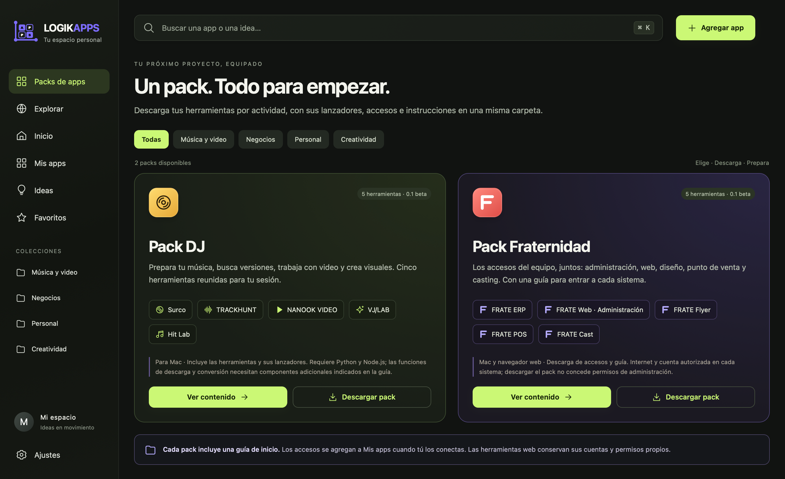

# LOGIKAPPS

[](https://github.com/pablohidalgochile-source/LOGIKAPPS/actions/workflows/check.yml)

**Tus herramientas, a un clic. Un lugar para tu próxima idea.**

LOGIKAPPS reúne packs de herramientas, accesos personales e ideas en una ventana propia para Mac. Elige un pack, prepara lo que quieras usar y conecta sus lanzadores o enlaces a **Mis apps**.



## Descargar para Mac

**[Descargar LOGIKAPPS 0.4.0 beta para Mac](https://github.com/pablohidalgochile-source/LOGIKAPPS/releases/download/v0.4.0-beta.1/LOGIKAPPS-0.4.0-macos-universal.dmg)**

[Notas de la versión y verificación de descarga](https://github.com/pablohidalgochile-source/LOGIKAPPS/releases/tag/v0.4.0-beta.1)

- macOS 13 o posterior; ejecutable universal para Apple Silicon e Intel.
- **Beta sin notarización de Apple.** Consulta [Instalación](docs/INSTALACION.md) si macOS impide abrirla. No se requiere desactivar las protecciones del sistema.
- LOGIKAPPS funciona sin Node.js ni Python. Las herramientas de los packs tienen sus propios requisitos.

## Elige tu pack

| Pack | Contenido | Cómo empezar |
|---|---|---|
| **[Pack DJ](https://github.com/pablohidalgochile-source/LOGIKAPPS/releases/download/v0.4.0-beta.1/LOGIKAPPS-Pack-DJ-0.1.0-beta.zip)** | Surco, TRACKHUNT, NANOOK VIDEO, VJ/LAB y Hit Lab; herramientas locales y lanzadores | Descomprime y abre `EMPIEZA-AQUI.html`. Prepara los requisitos de cada herramienta antes de conectar su lanzador. |
| **[Pack Fraternidad](https://github.com/pablohidalgochile-source/LOGIKAPPS/releases/download/v0.4.0-beta.1/LOGIKAPPS-Pack-Fraternidad-0.1.0-beta.zip)** | Cinco accesos oficiales: ERP, WEB, FLYER, POS y CAST | Descomprime y abre `GUIA.html`. Usa tu cuenta autorizada en cada servicio. |

**Descargar un pack no instala automáticamente sus dependencias ni concede permisos.** El Pack DJ incluye fuentes o interfaces preparadas y lanzadores locales; no son cinco aplicaciones `.app` autónomas. El Pack Fraternidad contiene enlaces y una guía, sin código privado, credenciales ni datos del negocio.

[Consulta los requisitos, instrucciones y límites de cada herramienta](docs/CONTENIDO.md). **Explorar** conserva la selección individual de Surco, FRATV para OBS y FRATE Web.

## Empieza a usar LOGIKAPPS

1. Instala la app y ábrela. Con una biblioteca vacía verás **Packs de apps**.
2. Elige **Ver contenido**, descarga el pack y sigue su guía. Para una herramienta local, prepara sus requisitos y usa **Conectar lanzador** para seleccionar el archivo `Abrir … .command`; para una web, usa **Agregar a Mis apps**.
3. También puedes usar **Agregar app** para conectar tus propias aplicaciones, enlaces o carpetas. Organiza los accesos por colecciones y marca tus favoritos.
4. Guarda una **Nueva idea**, cambia su etapa y vincúlala a una herramienta cuando exista.
5. Para conservar el icono: menú del icono en el Dock → **Opciones → Mantener en el Dock**.

**Las bibliotecas existentes se conservan al actualizar.** Si ya tienes accesos, seguirás viéndolos en Mis apps y podrás abrir Packs de apps desde la barra lateral. Si la beta anterior te aparecía vacía, instala esta versión y vuelve a abrirla: aparecerán los packs sin importar la biblioteca de otra persona.

## Funciones

- Packs por actividad con contenido, requisitos e instrucciones de inicio.
- Catálogo Explorar con enlaces públicos y descargas individuales.
- Búsqueda de packs, herramientas e ideas, con o sin acentos.
- Colecciones, favoritos y accesos recientes.
- Agregar, editar y quitar accesos sin eliminar las aplicaciones originales.
- Ideas con descripción, etapas y vínculo a una herramienta existente.
- Exportar y restaurar tu biblioteca con copia previa de seguridad.
- Interfaz local sin cuenta de LOGIKAPPS, publicidad, analítica ni servicios de IA.

Los enlaces y herramientas que abras pueden necesitar internet o sus propias cuentas. **Ver carpeta** abre Finder. Escribir una idea no genera automáticamente una aplicación.

## Tus datos

La edición de Mac guarda la biblioteca en `~/Library/Application Support/LOGIKAPPS/`. Reinstalar la app conserva esa biblioteca. Packs y Explorar están separados de los accesos, ideas y favoritos personales; no los reemplazan ni los publican.

Importar una copia reemplaza la biblioteca actual y conserva una copia anterior. Una exportación puede contener nombres de proyectos, notas, enlaces y rutas: revísala antes de compartirla. Las rutas de un Mac no necesariamente existen en otro.

La interfaz también puede abrirse como **vista web** desde `web/index.html`; guarda sus datos en ese navegador. El lanzamiento de herramientas del Mac requiere la app nativa. Ambas vistas tienen bibliotecas independientes.

## Compilar y probar

En un Mac con las herramientas de desarrollo de Apple:

```sh
git clone https://github.com/pablohidalgochile-source/LOGIKAPPS.git
cd LOGIKAPPS
./scripts/build-macos.sh
./.build/LOGIKAPPS.app/Contents/MacOS/LOGIKAPPS --self-test
```

Con Node.js instalado, ejecuta las pruebas de interfaz y FRATV:

```sh
node --test tests/*.test.cjs
```

Para comprobar la interfaz real, usa una carpeta temporal y una sesión gráfica de macOS:

```sh
LOGIKAPPS_DATA_DIR="$(mktemp -d /tmp/logikapps-smoke.XXXXXX)" \
  ./.build/LOGIKAPPS.app/Contents/MacOS/LOGIKAPPS --ui-smoke-test
```

Para crear los paquetes y el instalador:

```sh
python3 scripts/package-surco.py
python3 scripts/package-fratv.py
python3 scripts/package-packs.py
./scripts/create-dmg.sh
```

Consulta [Distribución](docs/DISTRIBUCION.md) para compilar, verificar, firmar y notarizar una futura entrega.

## Estado de esta beta

La suite principal de entrega incluye **108 comprobaciones automatizadas**: 64 nativas, 33 del frontend y 11 de FRATV. La prueba de la interfaz nativa recorre ambos packs y sus cinco herramientas, además de la biblioteca personal. Las comprobaciones de las herramientas del Pack DJ se detallan por separado en [Verificación](docs/VERIFICACION.md).

La validación local se realiza en Apple Silicon; el ejecutable universal contiene también Intel. No se afirma que todas las herramientas o versiones de macOS estén certificadas. En esta preparación no se descargó música de plataformas, no se capturó audio ni se realizaron operaciones dentro de los sistemas de Fraternidad. Hit Lab sí se comprobó exportando un sonido sintetizado por la propia herramienta.

Los resultados remotos aparecen en [GitHub Actions](https://github.com/pablohidalgochile-source/LOGIKAPPS/actions/workflows/check.yml). Puedes comunicar fallos en [Issues](https://github.com/pablohidalgochile-source/LOGIKAPPS/issues), indicando versión de macOS y pasos para reproducirlos, sin adjuntar datos personales ni credenciales.
