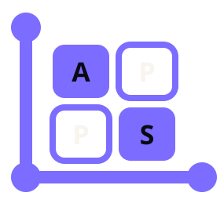
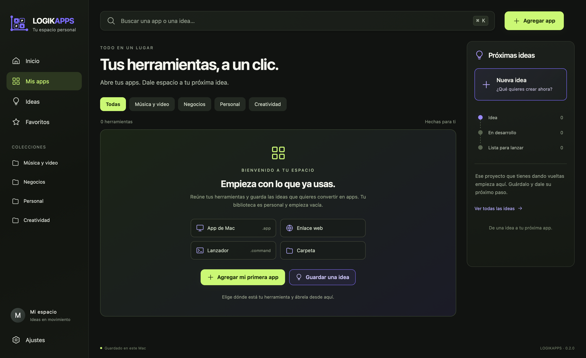

# LOGIKAPPS

**Tus herramientas, a un clic. Un lugar para tu próxima idea.**

LOGIKAPPS es una biblioteca personal de aplicaciones, enlaces y proyectos, con una ventana propia en Mac. Organiza tus herramientas por colecciones, guarda favoritos y acompaña tus ideas desde el primer apunte hasta una app lista para abrir.



## Descargar para Mac

**[Descargar LOGIKAPPS 0.2.0 beta para Mac](https://github.com/pablohidalgochile-source/LOGIKAPPS/releases/download/v0.2.0-beta.1/LOGIKAPPS-0.2.0-macos-universal.dmg)**

[Notas de la versión y verificación de descarga](https://github.com/pablohidalgochile-source/LOGIKAPPS/releases/tag/v0.2.0-beta.1)

- macOS 13 o posterior; ejecutable universal para Apple Silicon e Intel.
- **Beta sin notarización de Apple.** macOS puede advertir o impedir la apertura de esta descarga. Consulta [Instalación](docs/INSTALACION.md) antes de descargarla. No se requiere desactivar las protecciones del sistema.
- También puedes [compilar desde el código](#compilar-y-probar).

## Empieza con tus herramientas

1. Instala la app y abre **LOGIKAPPS**.
2. Pulsa **Agregar app** y elige una aplicación de tu Mac, una carpeta, un lanzador `.command` o un enlace web.
3. Organiza tus accesos en **Música y video, Negocios, Personal o Creatividad** y marca tus favoritos.
4. Guarda una **Nueva idea**, cambia su etapa y vincúlala a una app de tu biblioteca cuando exista.
5. Para conservar el icono: menú del icono en el Dock → **Opciones → Mantener en el Dock**.

Cada persona empieza con su propia biblioteca vacía. La descarga **no incluye aplicaciones ajenas, cuentas, contraseñas, rutas personales ni proyectos del creador**. Agregar una herramienta a LOGIKAPPS no la instala ni concede acceso a sus servicios.

## Funciones

- Búsqueda de aplicaciones e ideas, incluidas palabras con o sin acentos.
- Colecciones, favoritos y accesos recientes.
- Agregar, editar y quitar accesos sin eliminar las aplicaciones originales.
- Ideas con descripción, etapas y vínculo a una herramienta existente.
- Exportar y restaurar tu biblioteca con copia previa de seguridad.
- Interfaz local sin cuenta de LOGIKAPPS, publicidad, analítica ni servicios de IA.

Los enlaces y las apps que decidas abrir pueden necesitar internet o sus propias cuentas. Un acceso **Ver carpeta** abre Finder; no ejecuta ni completa ese proyecto. Las ideas se organizan manualmente: escribir una idea no genera automáticamente una aplicación.

## Tus datos

La edición de Mac guarda la biblioteca en `~/Library/Application Support/LOGIKAPPS/`. Reinstalar la app no reinicia esa biblioteca. Importar una copia reemplaza la biblioteca actual y conserva una copia anterior en el equipo.

Una exportación puede contener tus nombres de proyectos, notas, enlaces y rutas. Revísala antes de compartirla. Las rutas locales de una persona no necesariamente existen en el Mac de otra.

La interfaz también puede abrirse como una **vista web** desde `web/index.html`; guarda sus datos en ese navegador. El lanzamiento de herramientas del Mac requiere la app nativa. Ambas vistas tienen bibliotecas independientes.

## Compilar y probar

En un Mac con las herramientas de desarrollo de Apple:

```sh
git clone https://github.com/pablohidalgochile-source/LOGIKAPPS.git
cd LOGIKAPPS
./scripts/build-macos.sh
./.build/LOGIKAPPS.app/Contents/MacOS/LOGIKAPPS --self-test
```

Pruebas de la interfaz, con Node.js instalado:

```sh
node --test tests/frontend.test.cjs
```

Para probar el puente nativo y la interfaz real, usa una carpeta temporal y una sesión gráfica de macOS:

```sh
LOGIKAPPS_DATA_DIR="$(mktemp -d /tmp/logikapps-smoke.XXXXXX)" \
  ./.build/LOGIKAPPS.app/Contents/MacOS/LOGIKAPPS --ui-smoke-test
```

Para crear el instalador:

```sh
./scripts/create-dmg.sh
```

La interfaz no necesita Node.js ni Python para funcionar. Una herramienta externa conectada puede tener sus propios requisitos. Consulta [Distribución](docs/DISTRIBUCION.md) para compilar, firmar y notarizar una futura entrega.

## Estado de esta beta

El proyecto está en fase de pruebas. El ejecutable universal contiene ambas arquitecturas; la validación local se realiza en Apple Silicon. Las comprobaciones de integración continua aparecen en la pestaña **Actions**. No se afirma que las herramientas añadidas por cada persona hayan sido probadas por LOGIKAPPS.

Puedes comunicar un fallo en [Issues](https://github.com/pablohidalgochile-source/LOGIKAPPS/issues). Indica tu versión de macOS, el tipo de Mac y los pasos para reproducirlo. Evita adjuntar bibliotecas completas, credenciales o capturas con información personal.
